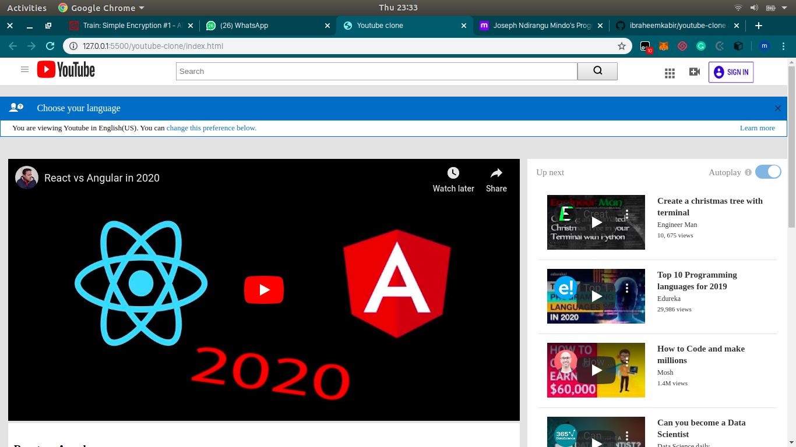

# youtube-clone

> This is a youtube clone with layout and styling done with css and html.

Additional description about the project and its features.

## Built With

- HTML AND CSS
- No frameworks,

## Getting Started

**Clone the project**
**Navigate to project directory, open index.html file in your preferred browser**

To get a local copy up and running follow these simple example steps.

### Prerequisites
- None

### Setup
- None required

### Install
- None required

## Authors

👤 **Ibraheem Kabir**

- Github: [@ibraheemkabir](https://github.com/ibraheemkabir)

👤 **Joseph Mindo**

- Github: [@Mindo-Joseph](https://github.com/Mindo-Joseph)

## 🤝 Contributing

Contributions, issues and feature requests are welcome!

Feel free to check the [issues page](issues/).

## Show your support

Give a ⭐️ if you like this project!

## Acknowledgments

- Microverse for providing the project task

## 📝 License

This project is [MiT](lic.url) licensed.# youtube-clone

